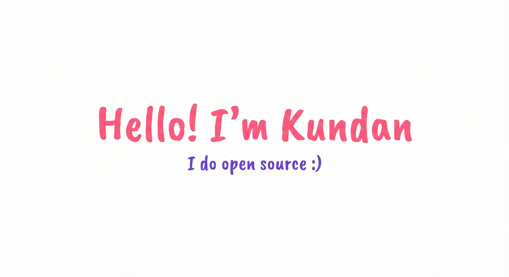

 

I'm a self-taught passionate developer from India 🇮🇳

**About me**

- 💬 Ask me about anything [here](https://github.com/i-kundankumar/i-kundankumar/issues)

<code></code>
<code></code>
<code></code>
<code></code>
<code></code>    

#### Top Repositories

 
 
